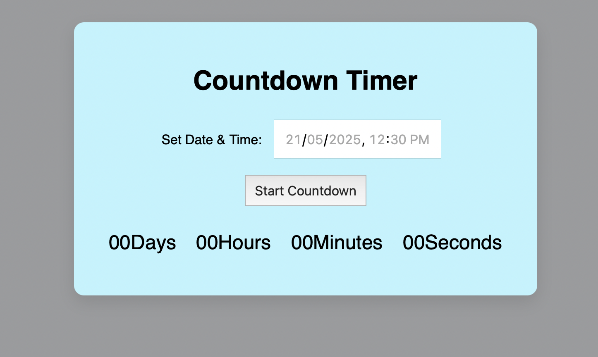

# Countdown Timer ⏳

A simple and interactive countdown timer web application built using **HTML**, **CSS**, and **JavaScript**.

## 🚀 Features

- Set a custom future date and time.
- Real-time countdown display in **days**, **hours**, **minutes**, and **seconds**.
- Displays a message when the countdown reaches zero.
- Clean, responsive user interface.

## 🛠️ Technologies Used

- HTML5
- CSS3
- JavaScript (ES6)

## 📁 Project Structure
countdown-timer/
├── index.html
├── style.css
└── script.js

## 📝 Documentation
How it works:

The user inputs a future date/time.
Clicking “Start Countdown” begins the timer.
Time updates every second using setInterval.
Displays "Time's up!" when countdown completes.

## 📸 Demo Preview

 *(Replace with actual screenshot if available)*

## 🧑‍💻 How to Run the Project

1. **Download or Clone this Repository**
   ```bash
   git clone https://github.com/Gnanendhra28/countdown-timer.git
